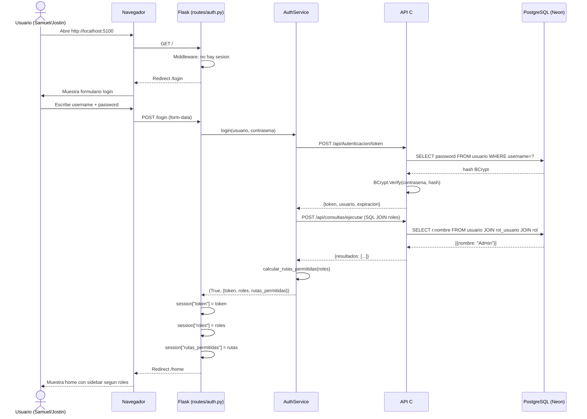
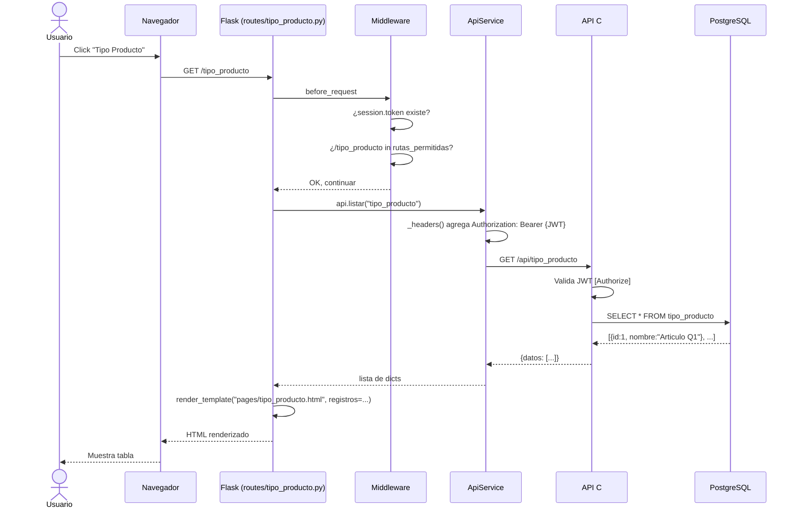
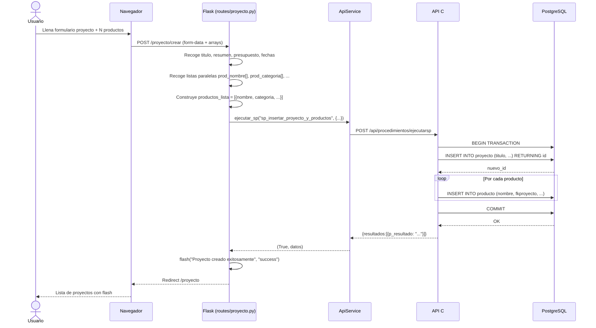
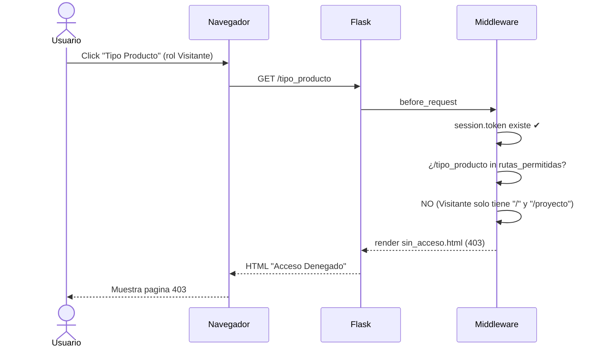
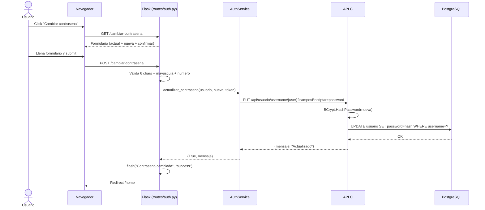
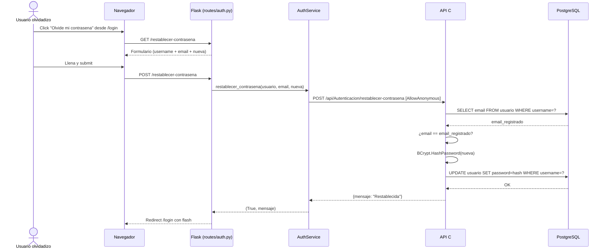
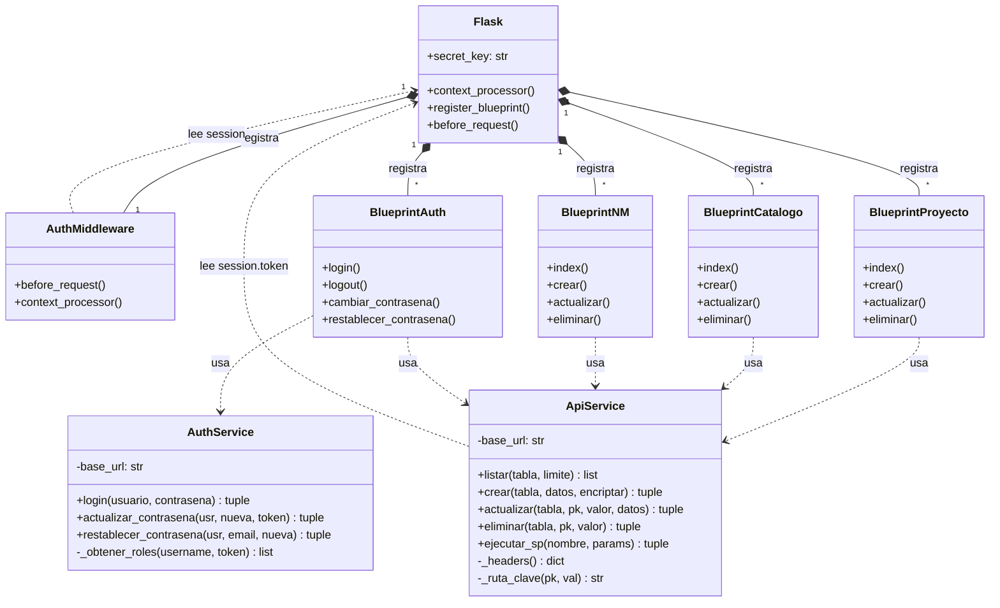

# Etapa 4: Plan de Implementación

Según **Spec-Kit**: el plan traduce los requisitos de la especificación en **decisiones técnicas concretas**. *"Cada elección de tecnología tiene una rationale documentada."* El plan se genera con `/speckit.plan` y el humano lo valida.

**Referencia**: [plan-template.md](https://github.com/github/spec-kit/blob/main/templates/plan-template.md)

---

## 1. Resumen técnico

Frontend web en **Flask** que consume la API genérica C# (`apicsharpneon-mapacto.runasp.net`) vía HTTP. Arquitectura **MVC adaptada**: `routes/` (controladores) + `services/` (lógica) + `templates/` (vistas). Autenticación con **BCrypt + JWT + sesión Flask**. Control de acceso por roles (`Admin`, `EncargadoProyectos`, `Visitante`) y rutas con middleware `before_request`. Operaciones maestro-detalle (proyecto + productos) implementadas con **Stored Procedures** para garantizar atomicidad.

---

## 2. Estructura de archivos del proyecto

```
FrontFlask-MapaCto/
└── FrontFlask/
    ├── app.py                           <- Punto de entrada: crea Flask, registra todo
    ├── config.py                        <- API_BASE_URL, SECRET_KEY
    ├── requirements.txt                 <- flask, requests
    ├── requirements-prod.txt            <- Para deploy en runasp.net
    ├── Procfile                         <- Para deploy en runasp.net
    │
    ├── services/
    │   ├── __init__.py
    │   ├── api_service.py               <- CRUD generico + ejecutar_sp (SPs)
    │   └── auth_service.py              <- Login, roles, rutas, ConsultasController, restablecer
    │
    ├── routes/
    │   ├── __init__.py
    │   ├── home.py                      <- /
    │   ├── auth.py                      <- /login, /logout, /cambiar-contrasena, /restablecer
    │   ├── proyecto.py                  <- /proyecto (maestro-detalle con SPs)
    │   ├── producto.py                  <- /producto (solo consulta)
    │   ├── tipo_producto.py             <- /tipo_producto (CRUD catalogo)
    │   ├── termino_clave.py             <- /termino_clave (CRUD catalogo)
    │   ├── palabras_clave.py            <- /palabras_clave (CRUD catalogo)
    │   ├── aa_proyecto.py               <- /aa_proyecto (N:M)
    │   ├── ac_proyecto.py               <- /ac_proyecto (N:M)
    │   ├── ods_proyecto.py              <- /ods_proyecto (N:M)
    │   ├── proyecto_linea.py            <- /proyecto_linea (N:M)
    │   ├── aliado_proyecto.py           <- /aliado_proyecto (N:M)
    │   ├── docente_producto.py          <- /docente_producto (N:M)
    │   └── desarrolla.py                <- /desarrolla (N:M con atributos rol/descripcion)
    │
    ├── middleware/
    │   └── auth_middleware.py           <- before_request + context_processor
    │
    ├── templates/
    │   ├── layout/
    │   │   └── base.html                <- Layout: sidebar + top-row + content + Bootstrap
    │   ├── components/
    │   │   └── nav_menu.html            <- Menu lateral colapsable
    │   └── pages/
    │       ├── home.html
    │       ├── login.html
    │       ├── cambiar_contrasena.html
    │       ├── restablecer_contrasena.html
    │       ├── sin_acceso.html
    │       ├── proyecto.html             <- Maestro-detalle con filas dinamicas
    │       ├── producto.html
    │       ├── tipo_producto.html
    │       ├── termino_clave.html
    │       ├── palabras_clave.html
    │       ├── aa_proyecto.html
    │       ├── ac_proyecto.html
    │       ├── ods_proyecto.html
    │       ├── proyecto_linea.html
    │       ├── aliado_proyecto.html
    │       ├── docente_producto.html
    │       └── desarrolla.html
    │
    ├── static/css/                      <- Estilos custom
    │
    └── sdd/                             <- Documentacion SDD (estos archivos)
```

---

## 3. Orden de implementación (por etapas)

Cada etapa corresponde a un grupo de funcionalidades y a una o más ramas `feature/`.

| Orden | Etapa | Qué se implementa | Dependencias | Responsable |
|-------|-------|-------------------|--------------|-------------|
| 1 | Etapa 0 | Plan de desarrollo, reglas SDD | Ninguna | Samuel + Jostin |
| 2 | Etapa 1 | Proyecto base: `app.py`, `config.py`, Git | Etapa 0 | Samuel |
| 3 | Etapa 2 | `ApiService` (CRUD + `ejecutar_sp`) | Etapa 1 | Samuel |
| 4 | Etapa 3 | Layout base, `nav_menu`, `home` | Etapa 2 | Samuel |
| 5 | Etapa 4 | CRUD catálogos: `tipo_producto`, `termino_clave`, `palabras_clave` | Etapa 3 | Samuel |
| 6 | Etapa 5 | Maestro-detalle `proyecto` + SPs | Etapa 4 | Samuel |
| 7 | Etapa 6 | Consulta `producto` | Etapa 5 | Jostin |
| 8 | Etapa 7 | N:M: `aa_proyecto`, `ac_proyecto`, `ods_proyecto`, `proyecto_linea`, `aliado_proyecto` | Etapa 5 | Jostin |
| 9 | Etapa 8 | N:M docentes: `docente_producto`, `desarrolla` (PK compuesta) | Etapa 7 | Jostin |
| 10 | Etapa 9 | Login + JWT + middleware + roles + restablecer | Etapa 3 | Samuel + Jostin |

### Diagrama de dependencias

```
Etapa 0 (plan SDD)
  |
  v
Etapa 1 (proyecto base)
  |
  v
Etapa 2 (ApiService)
  |
  v
Etapa 3 (layout + nav + home)
  |
  +---------+----------+
  v         v          v
Etapa 4   Etapa 9     (paralelo: catalogos / login)
  |         |
  v         |
Etapa 5     |  (maestro-detalle proyecto con SPs)
  |         |
  +---------+
  |
  v
Etapa 6 + 7 + 8  (paralelo: consulta producto, N:M, desarrolla)
```

---

## 4. Modelo de datos

### Tablas de negocio

| Tabla | PK | Campos clave | FKs |
|-------|-----|--------------|-----|
| `proyecto` | `id` | `titulo`, `resumen`, `presupuesto`, `tipo_financiacion`, `tipo_fondos`, `fecha_inicio`, `fecha_fin` | — |
| `producto` | `id` | `nombre`, `categoria`, `fecha_entrega` | `fkproyecto` → `proyecto`, `fktipo_producto` → `tipo_producto` |
| `tipo_producto` | `id` | `nombre` | — |
| `docente` | `cedula` | `nombre`, `correo` | — |
| `aliado` | `id` | `nombre` | — |

### Tablas catálogo

| Tabla | PK | Campos |
|-------|-----|--------|
| `termino_clave` | `id` | `termino` |
| `palabras_clave` | `id` | `palabra` |
| `aa` | `id` | `nombre` (Área Académica) |
| `ac` | `id` | `nombre` (Área de Conocimiento) |
| `ods` | `id` | `nombre`, `numero` |
| `linea` | `id` | `nombre` |

### Tablas relacionales (N:M)

| Tabla | PK compuesta | Atributos extra |
|-------|--------------|-----------------|
| `aa_proyecto` | `(fkproyecto, fkaa)` | — |
| `ac_proyecto` | `(fkproyecto, fkac)` | — |
| `ods_proyecto` | `(fkproyecto, fkods)` | — |
| `proyecto_linea` | `(fkproyecto, fklinea)` | — |
| `aliado_proyecto` | `(fkproyecto, fkaliado)` | — |
| `docente_producto` | `(fkdocente, fkproducto)` | — |
| `desarrolla` | `(docente, proyecto)` | `rol`, `descripcion` |

### Tablas de seguridad (auth)

| Tabla | PK | Campos | FKs |
|-------|-----|--------|-----|
| `usuario` | `id` | `username`, `email`, `password` (BCrypt) | — |
| `rol` | `id` | `nombre` | — |
| `rol_usuario` | `id` | — | `usuario_id`, `rol_id` |
| `ruta` | `id` | `ruta`, `descripcion` | — |
| `rutarol` | `id` | — | `fkidrol`, `fkidruta` |

---

## 5. Decisiones técnicas

| Decisión | Alternativa | Razón |
|----------|-------------|-------|
| Stored Procedures para `proyecto` | N llamadas POST individuales | Atomicidad maestro-detalle |
| `ConsultasController` (1 SQL) | GETs separados | Eficiencia: la BD filtra, no Python |
| Cookie firmada (Flask session) | JWT stateless | Flask lo trae integrado |
| `requests` síncrono | `httpx` async | Simplicidad para trabajo académico |
| Bootstrap CDN | `npm install` | Sin build tools |
| Middleware `before_request` | Decorador `@login_required` | Protege TODO automáticamente |
| `context_processor` | Pasar vars manual | Inyecta en todas las templates |
| API en `runasp.net` (remota) | API local | Permite trabajo colaborativo Samuel + Jostin |
| Roles hardcodeados en `auth_service` | Tabla `rutarol` en BD | Implementación inicial simple; futura migración a `rutarol` |

---

## 6. Endpoints de la API utilizados

### CRUD genérico (cada tabla)

```
GET    /api/{tabla}?limite=N                                 <- Listar
POST   /api/{tabla}                                          <- Crear
PUT    /api/{tabla}/{pk}/{valor}                             <- Actualizar
PUT    /api/{tabla}/{pk1}/{val1}/{pk2}/{val2}                <- Actualizar PK compuesta
DELETE /api/{tabla}/{pk}/{valor}                             <- Eliminar
DELETE /api/{tabla}/{pk1}/{val1}/{pk2}/{val2}                <- Eliminar PK compuesta
```

### Stored Procedures (maestro-detalle)

```
POST   /api/procedimientos/ejecutarsp                        <- Ejecuta cualquier SP
   sp_insertar_proyecto_y_productos
   sp_actualizar_proyecto_y_productos
   sp_borrar_proyecto_y_productos
   sp_consultar_proyecto_y_productos
```

### Autenticación y seguridad

```
POST   /api/Autenticacion/token                              <- Login BCrypt + JWT
POST   /api/Autenticacion/restablecer-contrasena             <- Restablecer (publico)
POST   /api/consultas/ejecutarconsultaparametrizada          <- SQL JOIN roles
PUT    /api/usuario/{pk}/{val}?camposEncriptar=password      <- Cambiar clave
```

---

## 7. Diagramas de secuencia

Los diagramas de secuencia muestran la interacción entre componentes en el tiempo. Formato **Mermaid** — se renderiza automáticamente en GitHub.

### 7.1 Secuencia: Login completo



### 7.2 Secuencia: CRUD Listar con JWT



### 7.3 Secuencia: CRUD Crear proyecto con SP (maestro-detalle)



### 7.4 Secuencia: Acceso denegado



### 7.5 Secuencia: Cambiar contraseña



### 7.6 Secuencia: Restablecer contraseña (público)



---

## 8. Diagrama de clases

Muestra las clases Python del proyecto, sus atributos, métodos y relaciones. Formato **Mermaid** — se renderiza en GitHub.

### 8.1 Diagrama de clases completo



### 8.2 Relaciones entre clases

| Relación | Tipo | Descripción |
|----------|------|-------------|
| `Flask` → `AuthMiddleware` | Composición | Flask registra el middleware al iniciar |
| `Flask` → `Blueprints` | Composición | Flask registra todos los blueprints |
| `BlueprintProyecto` → `ApiService` | Dependencia | Usa `ejecutar_sp` para SPs maestro-detalle |
| `BlueprintCatalogo` → `ApiService` | Dependencia | Usa `listar/crear/actualizar/eliminar` |
| `BlueprintNM` → `ApiService` | Dependencia | Usa CRUD con PK compuesta |
| `BlueprintAuth` → `AuthService` | Dependencia | Usa login, roles, restablecer |
| `ApiService` → `Flask session` | Uso | Lee token JWT para `_headers()` |
| `AuthService` — `ApiService` | Independiente | Cada uno usa `requests` por separado |

### 8.3 ¿Por qué `AuthService` es independiente de `ApiService`?

```
AuthService usa requests.post/put directo, NO ApiService.

Razón: ApiService asume que ya hay un JWT en la sesión (lee session.token
en _headers()). Pero AuthService es quien GENERA el JWT — todavía no hay
sesión cuando se hace login. Si AuthService usara ApiService, habría una
dependencia circular: ApiService necesita el token que AuthService aún
no ha obtenido.

Además, AuthService con requests directo funciona en CUALQUIER proyecto
Flask, sin importar como esté implementado ApiService.

AuthService                    ApiService
  |                              |
  +-- requests.post/put          +-- requests.get/post/put/delete
  |   (sin token o con token     |   (con _headers() lee session.token)
  |    pasado por parametro)     |
  v                              v
  API Generica C# en runasp.net  API Generica C# en runasp.net
```

---

## Referencias Spec-Kit

- **Formato plan**: [plan-template.md](https://github.com/github/spec-kit/blob/main/templates/plan-template.md)
- **Principio de simplicidad**: [spec-driven.md, Artículo VII](https://github.com/github/spec-kit/blob/main/spec-driven.md)
- **Flujo SDD**: [README de Spec-Kit](https://github.com/github/spec-kit)
- **Mermaid (diagramas)**: [mermaid.js.org](https://mermaid.js.org)

---

## Fecha de ratificación

- **Versión**: 1.0
- **Fecha**: 2026-05-21
- **Autores**: Samuel Giraldo, Jostin (Estudiantes Diseño de Software USB)
- **Referencia Spec-Kit**: [github.com/github/spec-kit](https://github.com/github/spec-kit)
